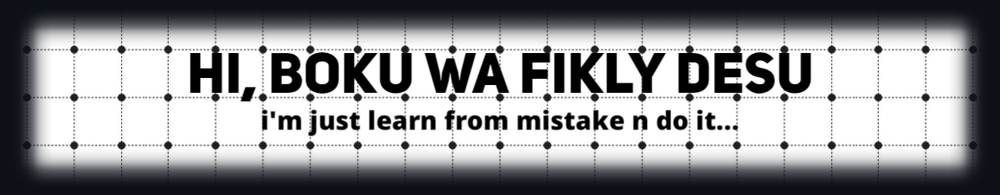

 

 
 
 

 <h1><b>About me</b></h1>

 

  

###

I'm Cujud and I am from Indonesia.
    - 🔭 I’m currently a student in Computer Science, where I primarily learn Rust, C++, and more.
   - 📚 I'm currently learning and coding in Rust, C++, Python, Next js and more. I also have been working on a web dev in Next js.
   - ⚡ In my free time I Upload video (I'm posting in my youtube channel).

###

<h3 align="left">🛠 Languages and tools</h3>

###
<!-- List of all icons: https://github.com/devicons/devicon/tree/master/icons | you can choose between original, and plain -->

  
  
  
  
  
  
  
  

###

  
  
  
  
  

###

  
  

###

 

###

 
 
 

